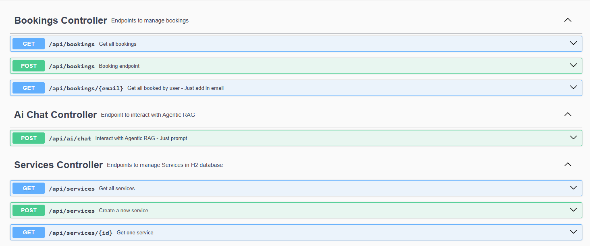

# Conversational Booking API – Spring Boot + LangChain4j + Gemini

AI-powered booking API using Spring Boot, LangChain4j, and Gemini. Interact with your services via natural language.

## Features
- Agentic RAG (Retrieval-Augmented Generation) with tool calling
- LangChain4j integration with Google Gemini
- Dynamic service and booking system using H2 database
- Cancel bookings using unique keys
- Clean modular structure for tool injection

### Available Endpoints
